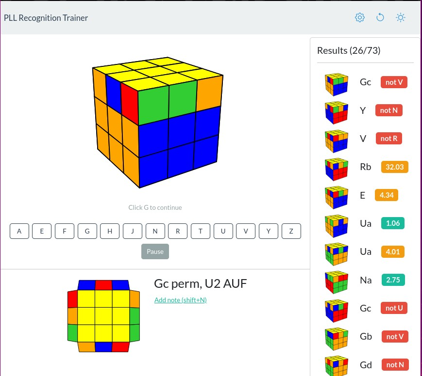

# PLL Recognition Trainer: [bestsiteever.net/pll_recognition](https://bestsiteever.net/pll_recognition).



Web based trainer for practicing PLL (Permutation of the Last Layer) recognition for speedcubing. Presents PLL cases from multiple angles and lets you answer quickly using keyboard shortcuts. Adapts to your performance to focus on the cases that need more work.

- **Interactive practice** – An image of a PLL case is shown and you press the key corresponding to its name.
- **Instant feedback** – When you make a mistake, the correct answer appears right away.
- **Varied angles** – Each case can be displayed in twelve different orientations.
- **Personal notes** – You can record your own notes on how you spot each case, which are shown whenever you answer that case incorrectly.
- **Evaluation mode** – After an evaluation session you get a breakdown of which cases and angles gave you trouble.
- **Adaptive sessions** – Future practice will surface cases that you answered slowly or incorrectly more often.
- **Customizable settings** – Options include multi‑color practice, front/side orientation, and color schemes that match your cube. Settings can be reset to defaults.

Live site: [bestsiteever.net/pll_recognition](https://bestsiteever.net/pll_recognition). Video overview: [YouTube](https://youtu.be/lIjel-amSeg?si=nLCzXIcVpmAKlFyn).

## Development

Vue 3 + [Vite](https://vitejs.dev/). To start a local development server:

```bash
npm install
npm run dev
```

To build for production:

```bash
npm run build
```