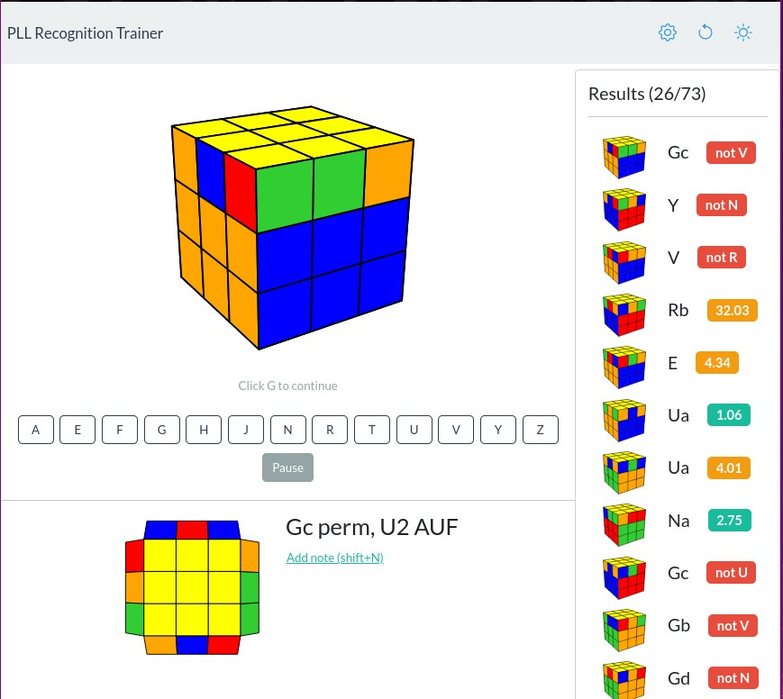

# PLL Recognition Trainer

**[bestsiteever.net/pll_recognition](https://bestsiteever.net/pll_recognition)**



A browser-based trainer for speedcubers to practice recognizing PLL (Permutation of the Last Layer) cases. Presents each case in up to 16 variations (4 AUFs x 4 color shifts) and adapts to your performance so you spend more time on the cases you struggle with. No account needed — everything runs client-side with localStorage.

Video overview: [YouTube](https://youtu.be/lIjel-amSeg?si=nLCzXIcVpmAKlFyn)

## Features

### Training & Feedback

- **73 distinct patterns** across 21 PLL cases, each shown in multiple orientations and color shifts
- **Keyboard-driven input** — press the letter key matching the case name (e.g. `A` for A-perm, `G` for G-perm). Full-name mode is available for two-letter cases (Aa, Gb, etc.)
- **Instant feedback** — wrong answers reveal the correct case immediately
- **Recognition guide hints** — on a mistake, a card from [Mark Rivers' Two-Sided PLL Recognition Guide](https://www.speedsolving.com/threads/two-sided-pll-recognition-guide.53180/) appears with the relevant row highlighted, showing you what to look for
- **Personal notes** — record your own recognition cues for each case; they resurface whenever you get that case wrong
- **Mobile support** — on-screen keyboard with all 13 PLL letter buttons (or 21 full-name buttons)

### Adaptive Learning

After each evaluation session, the trainer rebuilds the practice queue based on your results:

| Performance tier | Repetitions |
|-----------------|-------------|
| Worst 15% | 4x |
| Next 15% | 3x |
| Next 20% | 2x |
| Remaining | 1x |
| Unattempted | 1x |

Each repetition gets a fresh random AUF and color shift so you can't memorize a specific angle.

### Recognition Guide Integration

When you answer incorrectly, the trainer shows the matching entry from the Two-Sided PLL Recognition Guide — a systematic method for identifying PLLs by examining two adjacent top-row faces.

Under the hood, a pre-computed lookup table maps every `(case, rotation)` pair to a guide group and row. The lookup uses a minimal cube simulator (`cube_sim.js`) to determine which stickers are visible, then performs **structural pattern matching** — checking for any consistent color reassignment (plus mirror) that matches a guide pattern. This achieves full 73/73 coverage with zero conflicts.

The guide data is organized into 9 groups (3-Bar, Double Lights, Lights + 2-Bar, Lone Lights, Double 2-Bar, Outside 2-Bar, Inside 2-Bar, Bookends No Bar, No Bookends) displayed in a 3x3 grid on the home page and inline during training.

### Case Variations Modal

Click any PLL case image to open a full-screen modal showing all 16 variations of that case — 4 AUFs across 4 color shifts. Includes a cross-color selector, the matching guide card with the relevant row highlighted, and your personal notes.

### Customization

- **17 Bootstrap themes** — 12 light and 5 dark, with independent day/night selection
- **Cube view angles** — Right, Left, Center, or Center CubeSkills camera presets
- **Color scheme editor** — customize all 6 face colors to match your cube
- **Stroke width** — 7 levels from borderless to thick
- **Cross color filter** — choose which cross colors appear during practice

### Evaluation

After completing a full pass through the case queue, the evaluation screen shows:
- Overall accuracy and total time
- Per-case breakdown with average recognition time
- Worst cases highlighted for targeted review

## Tech Stack

- **Vue 3** (Composition API) + **Vite**
- **Pinia** for state management
- **Vue Router** (hash mode for static hosting)
- **Bootstrap 5** with swappable theme CSS
- **sr-puzzlegen-pll** for SVG cube rendering
- **Zero backend** — fully offline, no server or auth required

## Development

```bash
npm install
npm run dev       # start dev server
npm run build     # production build
npm run preview   # preview production build
```
